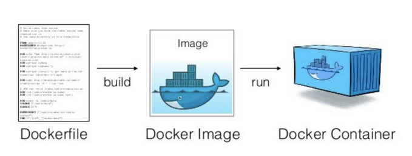
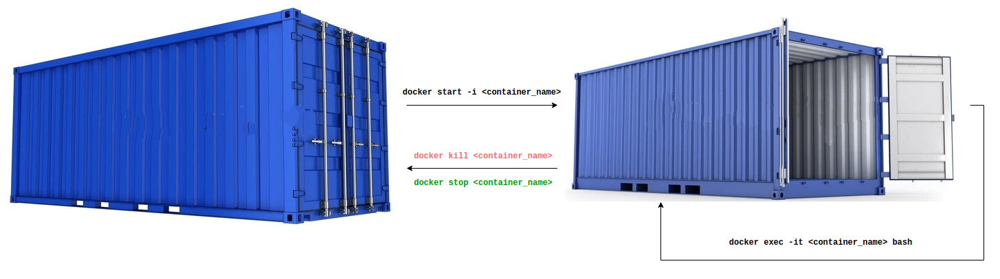

# Dockerfile repo

Brief theoretic [introduction](./Introduction.md).

This repository contains all Dockerfiles which are used for software containerization for easier integration, deployment, and development. 

## How to install the Docker engine?

To install the Docker engine follow these [instructions](https://docs.docker.com/engine/install/ubuntu/) for installation on Ubuntu. 

Besides official instructions, it is now possible to install docker using the following commands: 
```
curl https://get.docker.com | sh \
  && sudo systemctl --now enable docker
```

On Windows, the Docker engine is not supported. Instead, please follow these instructions to install Docker Desktop:
1. [Install WSL](https://learn.microsoft.com/en-us/windows/wsl/install). WSL is used as the backend for Docker.
2. [Install Docker Desktop](https://docs.docker.com/desktop/install/windows-install/)
3. _(Optional but recommended)_ Run a demo container as shown [here](https://docs.docker.com/guides/walkthroughs/run-a-container/)
4. You can use Docker with the help of the desktop application or use a command line interface in WSL as you normally would in Linux. **Important**: `docker` command will not work in WSL if Docker Desktop is not running (at least in the background).

## GPU support: 

In order to be able to use GPU effectively (assuming you have NVIDIA-GPU which is nowdays prevalent
for deep learning) you need to install `nvidia-container-toolkit`. 

To use nvidia-container-toolkit, platform requirements are following: 
* GNU/Linux x86_64 with kernel version > 3.10
* Docker >= 19.03
* NVIDIA GPU with Architecture >= Kepler (or compute capability 3.0)
* [NVIDIA Linux drivers](https://www.nvidia.com/en-us/drivers/unix/) >= 418.81.07

`nvidia-container-toolkit` can be installed by executing following commands: 
```
distribution=$(. /etc/os-release;echo $ID$VERSION_ID) \
      && curl -fsSL https://nvidia.github.io/libnvidia-container/gpgkey | sudo gpg --dearmor -o /usr/share/keyrings/nvidia-container-toolkit-keyring.gpg \
      && curl -s -L https://nvidia.github.io/libnvidia-container/$distribution/libnvidia-container.list | \
            sed 's#deb https://#deb [signed-by=/usr/share/keyrings/nvidia-container-toolkit-keyring.gpg] https://#g' | \
            sudo tee /etc/apt/sources.list.d/nvidia-container-toolkit.list
```

```
sudo apt-get update
```
```
sudo apt-get install -y nvidia-docker2
```
```
sudo systemctl restart docker 
```

**Add permissions for X server to enable running GUI applications from docker container:**
```
echo `xhost local:root` >> ~/.bashrc  
```

## Conceptual understanding

In next figure it is shown how to create docker container from Dockerfile 

 

In following figure it's possible to see how different commands for docker container are used: 




## How to build Dockerfile? 

Enter corresponding directory and run following command to build docker image: 
```
docker build -t <image_name>:<tag_name> <dockerfile_path> 
```

For concrete example (ros-kinetic with gazebo) run following: 
```
docker build -t ros_gazebo_img:melodic_11 .
```

## How to create container out of the Dockerfile? 

In order to create container from Dockerfile run following commmand:
```
docker run -it --network host --privileged -v /dev:/dev --name <container_name> <img_name>:<tag_name> 
```

Run docker container with GUI support 
```
docker run -it --network host --gpus all --privileged -e DISPLAY=$DISPLAY -v /dev:/dev -v /tmp/.X11-unix:/tmp/.X11-unix \
       --name <container_name> <img_name>:<tag_name> 
```
Also, before using param `--gpus` make sure you've installed `nvidia-container-toolkit` as mentioned before. 

Make sure you have latest drivers for your GPU. 

## How to start existing docker container after stopping it? 
```
docker start -i <container_name> 
```

## How to open running container in new bash? 
```
docker exec -it <container_name> bash 
```

## How to kill, stop, remove container? 

Kill container: 
```
docker kill  <container_name> 
```

Stop container: 
```
docker  stop <container_name> 
```

Remove container: 
```
docker rm <container_name> 
```

Attach existing detached cotainer: 
```
docker attach <container_name> 
```

Clean dangling images and stopped containers (bear in mind that this deletes 
every container that's not currently running, not recommended): 
```
docker system prune 
```

## SSH keys

Github removed support for the https cloning of private repositories. It is required to use 
SSH keys. 

In order to build docker image with SSH keys, you can use this command: 

```
DOCKER_BUILDKIT=1 docker build -t <img_name> --ssh default=${SSH_AUTH_SOCK} .
```

You can use ${SSH_AUTH_SOCK} after executing following commands: 
```
eval $(ssh-agent)
ssh-add ~/.ssh/id_rsa
```

which basically add your private keys during docker image build. 

### [Docker-CLI reference](https://docs.docker.com/engine/reference/commandline/build/)

### How to create configuration file that runs multiple docker files at once? 

In order to run multiple docker containers which are build from docker images in certain configuration 
use [docker-compose](https://docs.docker.com/compose/) 

## [Hardware acceleration](http://wiki.ros.org/docker/Tutorials/Hardware%20Acceleration)

To be able to properly use available GPU's it's necessary to follow instructions related to setting up docker 
container with proper arguments depending on GPU vendor. There are different commands and prerequisites (drivers) 
for almost every GPU vendor (NVIDIA,ATI,Intel). Rest of this instructions related to graphical rendering are written 
for NVIDIA GPUs, but [here](http://wiki.ros.org/docker/Tutorials/Hardware%20Acceleration) you can find everything 
else necessary to achieve same behaviour for different GPUs (Intel/ATI). 

#### Some examples can be found in ros-melodic folder, such as moveit_intel_ros (Intel) and moveit_ros (NVIDIA).  

### How to correctly use OpenGL for better rendering capabilities in container? 

Explanation for using ROS + Docker for GUI applications is available [here](http://wiki.ros.org/docker/Tutorials/GUI)

### Explanation of OpenGL + NVIDIA in Docker

Explanation for creating OpenGL image for CUDA applications can be found [here](https://medium.com/@benjamin.botto/opengl-and-cuda-applications-in-docker-af0eece000f1). 

Available prebuilt nvidia/openGL dockers can be found [here](https://medium.com/@benjamin.botto/opengl-and-cuda-applications-in-docker-af0eece000f1) 

### Example of build args 

There's example of using build-args for installing IDE in container in following [Dockerfile](https://github.com/larics/docker_files/blob/master/ros-melodic/moveit_ros/Dockerfile) 

```
docker build --build-arg <arg_name>=<arg_value> -t <image_name>:<image_tag> .
```
### Commit docker container to docker image

You can commit current state of docker image as follows: 
```
docker commit --author filip.zoric@fer.hr --pause --message "[fer-auth] integration" mmuav_audio_cont auth_fer_uav_img:latest
```

Such image you can then compress to `tar.gz` or push to docker registry. 

### Save docker image

You can save docker image with docker save command and compress it to gzip as follows: 
```
docker save <img_name>:<tag> | gzip > <archive_name>.tar.gz

```

### Most common problems 

One of the main problems that occurs when using Docker files for robotic applications is expiration of GPG keys for ROS. 
More about this incident can be found [here](https://discourse.ros.org/t/ros-gpg-key-expiration-incident/20669/)

In order to fix that, in case that some `sudo apt-get update` or `sudo apt-get install` fails, please replace GPG 
keys to newer ones. Error for expiration of GPG keys looks like following: 
```
An error occurred during the signature verification. The repository is not updated and the previous index files will be used. GPG error: http://packages.ros.org/ros/ubuntu bionic InRelease: 
The following signatures were invalid: EXPKEYSIG F42ED6FBAB17C654 Open Robotics <info@osrfoundation.org>
```

You can add keys by following 1.3 section in Installation instructions for corresponding ROS distribution. 

If you already have docker image built, and you get following error message when trying to install new ROS package: 
```

E: Failed to fetch http://packages.ros.org/ros/ubuntu/pool/main/r/ros-melodic-sound-play/ros-melodic-sound-play_0.3.11-1bionic.20210414.224641_amd64.deb  404  Not Found [IP: 140.211.166.134 80]
E: Unable to fetch some archives, maybe run apt-get update or try with --fix-missing?

```

You can fix it by typing following command: 
```
curl -s https://raw.githubusercontent.com/ros/rosdistro/master/ros.asc | sudo apt-key add -

```

## Git submodules

You can use and initialize git submodules with following command: 
```
git submodule update --init <submodule_name>
```

In this repo, currently is only `mbzirc` submodule. 
